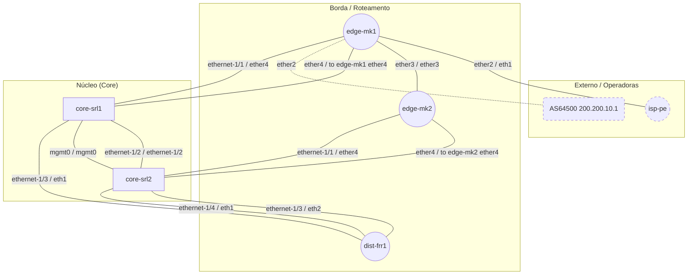

# Lab NetTopo - Containerlab

Documentação gerada automaticamente pelo **NetTopo 0.1.0** em 26/09/2026 17:19 a partir de `172.20.20.2, 172.20.20.11, 172.20.20.12, 172.20.20.21, 172.20.20.22, 172.20.20.31, 172.20.20.41, 172.20.20.42`.

## Resumo

| Indicador | Valor |
|---|---|
| Equipamentos coletados | 5 |
| Vistos apenas por vizinhos | 2 |
| Links físicos | 11 |
| Links L3 inferidos | 0 |
| Adjacências de roteamento | 1 |
| Interfaces | 142 |
| Alvos com falha | 2 |
| Duração (s) | 24.3 |
| Fabricantes | MikroTik (2), Nokia (2), Linux (2), Desconhecido (1) |

## Diagrama

## Inventário

| Hostname | IP | Papel | Camada | Fabricante | Modelo | Versão | Serial |
|---|---|---|---|---|---|---|---|
| [dist-frr1](devices/dist-frr1.md) | 172.20.20.31 | Roteador | Borda / Roteamento | Linux | Debian GNU/Linux 12 (bookworm) | 6.17.0-1022-azure | Virtual Machine |
| [edge-mk1](devices/edge-mk1.md) | 172.20.20.11 | Roteador | Borda / Roteamento | MikroTik | CHR QEMU Standard PC (i440FX + PIIX, 1996) | 7.16.2 (stable) |  |
| [edge-mk2](devices/edge-mk2.md) | 172.20.20.12 | Roteador | Borda / Roteamento | MikroTik | CHR QEMU Standard PC (i440FX + PIIX, 1996) | 7.16.2 (stable) |  |
| [core-srl1](devices/core-srl1.md) | 172.20.20.21 | Switch L3 | Núcleo (Core) | Nokia |  | 25.10.5-111 |  |
| [core-srl2](devices/core-srl2.md) | 172.20.20.22 | Switch L3 | Núcleo (Core) | Nokia |  | 25.10.5-111 |  |
| AS64500 200.200.10.1 _(não coletado)_ | 200.200.10.1 | Externo | Externo / Operadoras |  |  |  |  |
| isp-pe _(não coletado)_ | 172.20.20.2 | Roteador | Externo / Operadoras | Linux | Debian GNU/Linux 12 (bookworm) Linux 6.17.0-1022-azure #22-Ubuntu SMP Mon Jul 27 17:24:03 UTC 2026 x86_64 |  |  |

## Links

| ID | Origem | Interface | Destino | Interface | Tipo | Protocolos | Sub-rede |
|---|---|---|---|---|---|---|---|
| L1 | edge-mk1 | ether2 | isp-pe | eth1 | physical | lldp | 200.200.10.0/30 |
| L2 | edge-mk1 | ether3 | edge-mk2 | ether3 | physical | lldp | 172.31.255.28/30 |
| L3 | edge-mk1 | ether4 | core-srl1 | to edge-mk1 ether4 | physical | lldp | 10.10.1.0/30 |
| L4 | core-srl1 | ethernet-1/1 | edge-mk1 | ether4 | physical | lldp | 10.10.1.0/30 |
| L5 | edge-mk2 | ether4 | core-srl2 | to edge-mk2 ether4 | physical | lldp | 10.10.2.0/30 |
| L6 | core-srl2 | ethernet-1/1 | edge-mk2 | ether4 | physical | lldp | 10.10.2.0/30 |
| L7 | core-srl1 | ethernet-1/2 | core-srl2 | ethernet-1/2 | physical | lldp | 10.10.0.0/31 |
| L8 | core-srl1 | mgmt0 | core-srl2 | mgmt0 | physical | lldp | 172.20.20.0/24 |
| L9 | core-srl1 | ethernet-1/3 | dist-frr1 | eth1 | physical | lldp | 10.10.3.0/30 |
| L10 | core-srl2 | ethernet-1/3 | dist-frr1 | eth2 | physical | lldp | 10.10.4.0/30 |
| L11 | core-srl2 | ethernet-1/4 | dist-frr1 | eth1 | physical | lldp | 192.168.20.0/24 |
| L12 | edge-mk1 | ether2 | AS64500 200.200.10.1 |  | logical | bgp | 200.200.10.0/30 |

## Falhas de coleta

| Alvo | Motivo |
|---|---|
| 10.255.0.2 | sem resposta (portas fechadas / credenciais ausentes) |
| 172.20.20.2 | ssh: perfil sem driver Netmiko |
